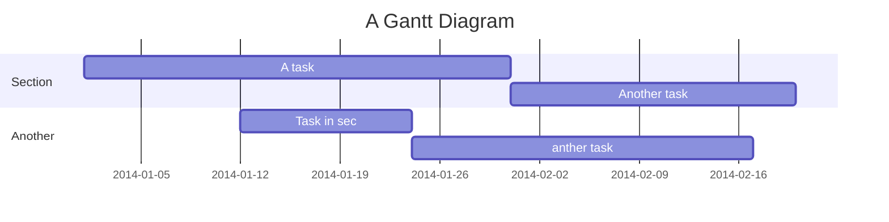

Yocto 工具集
===

<!--


-->

## 目錄

[TOC]

## 安裝 yocto

先下載 yocto 程式包 [DOWNLOADS](https://www.yoctoproject.org/software-overview/downloads/)；使用 git clone 並切換到 hardknott (寫這份文件時，最新的 branch)


``` bash=
$ mkdir ~/yocto
$ cd ~/yocto
$ git clone -b hardknott git://git.yoctoproject.org/poky.git
$ cd poky
$ source oe-init-build-env
$ pwd
```
``` bash
/home/<yourname>/yocto/poky/build
```

###### tags: `git` `yocto`

## bitbake-layers

:warning:注意：若在執行 bitbake 指令時，不能同時在跑其他的 bitbake 指令。

``` bash=
$ bitbake-layers command [arguments]
```

參數：
| command                 | Description                                                                                              |
|:----------------------- |:-------------------------------------------------------------------------------------------------------- |
| layerindex-fetch        | Fetches a layer from a layer index along with its dependent layers, and adds them to conf/bblayers.conf. |
| layerindex-show-depends | Find layer dependencies from layer index.                                                                |
| <font color="#f00">add-layer</font>               | Add one or more layers to bblayers.conf.                                                                 |
| <font color="#f00">remove-layer</font>             | Remove one or more layers from bblayers.conf.                                                            |
| flatten                 | flatten layer configuration into a separate output directory.                                            |
| <font color="#f00">show-layers</font>              | show current configured layers.                                                                          |
| show-overlayed          | list overlayed recipes (where the same recipe exists in another layer)                                   |
| show-recipes            | list available recipes, showing the layer they are provided by                                           |
| show-appends            | list bbappend files and recipe files they apply to                                                       |
| show-cross-depends      | Show dependencies between recipes that cross layer boundaries.                                           |
| <font color="#f00">create-layer</font>             | Create a basic layer                                                                                     |

### Example

#### 1. show current enabled layers

``` bash=1
$ bitbake-layers show-layers
```

``` bash
layer                 path                                      priority
==========================================================================
meta                  /home/anser/yocto/poky/meta               5
meta-poky             /home/anser/yocto/poky/meta-poky          5
meta-yocto-bsp        /home/anser/yocto/poky/meta-yocto-bsp     5
```

#### 2. add a layer

先下載一個可用的 layer，這裡用 Qt5 當作範例 

``` bash=+
cd ~/yocto/poky
git clone git://github.com/meta-qt5/meta-qt5.git
cd build
```

之後將剛下載的 Qt5 加入到 layer 裡

``` bash=+
$ bitbake-layers add-layer ../meta-qt5
$ bitbake-layers show-layers
```

``` bash
layer                 path                                      priority
==========================================================================
meta                  /home/anser/yocto/poky/meta               5
meta-poky             /home/anser/yocto/poky/meta-poky          5
meta-yocto-bsp        /home/anser/yocto/poky/meta-yocto-bsp     5
meta-qt5              /home/anser/yocto/poky/meta-qt5           7
```

#### 3. create a new layer

建立一個空的全新 layer

``` bash=+
$ bitbake-layers create-layer ../meta-my_layer
$ bitbake-layers add-layer ../meta-my_layer
$ bitbake-layers show-layers
```

``` bash
layer                 path                                      priority
==========================================================================
meta                  /home/anser/yocto/poky/meta               5
meta-poky             /home/anser/yocto/poky/meta-poky          5
meta-yocto-bsp        /home/anser/yocto/poky/meta-yocto-bsp     5
meta-qt5              /home/anser/yocto/poky/meta-qt5           7
meta-my_layer         /home/anser/yocto/poky/meta-my_layer      6
```

#### 4. delete a layer
``` bash=+
$ bitbake-layers remove-layer ../meta-my_layer
$ bitbake-layers show-layers
```
``` bash
layer                 path                                      priority
==========================================================================
meta                  /home/anser/yocto/poky/meta               5
meta-poky             /home/anser/yocto/poky/meta-poky          5
meta-yocto-bsp        /home/anser/yocto/poky/meta-yocto-bsp     5
meta-qt5              /home/anser/yocto/poky/meta-qt5           7
``` 
記得把 meta-my_layer 再加回去:rewind:，後面的範例會用到

###### tags: bitbake-layers qt5

## Creating the Base Recipe

### Using `devtool add`
    asdf

### Using `recipetool create`
    asdf

###### tags: devtool recipetool

User flows
---

```sequence
Alice->Bob: Hello Bob, how are you?
Note right of Bob: Bob thinks
Bob-->Alice: I am good thanks!
Note left of Alice: Alice responds
Alice->Bob: Where have you been?
```

> Read more about sequence-diagrams here: http://bramp.github.io/js-sequence-diagrams/

Project Timeline
---



> Read more about mermaid here: http://mermaid-js.github.io/mermaid/

## Appendix and FAQ

:::info
**Find this document incomplete?** Leave a comment!
:::

###### tags: `Templates` `Documentation`
